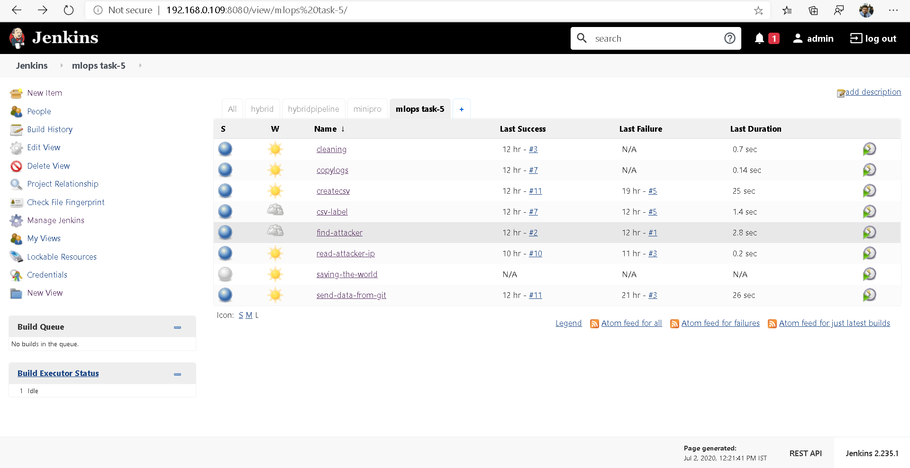
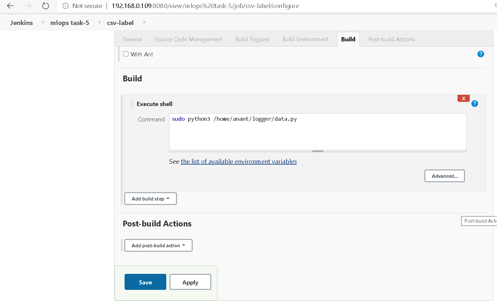
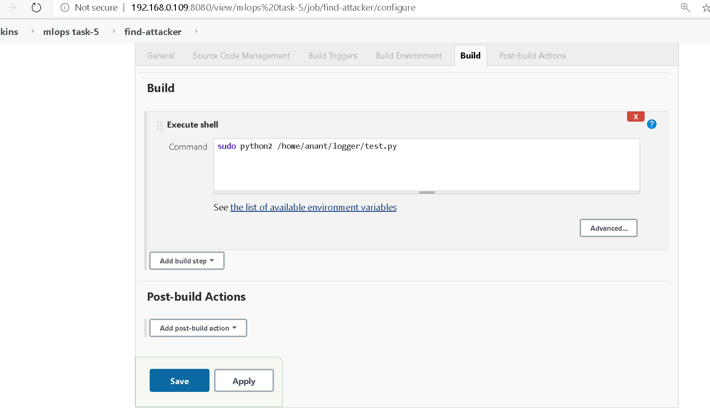
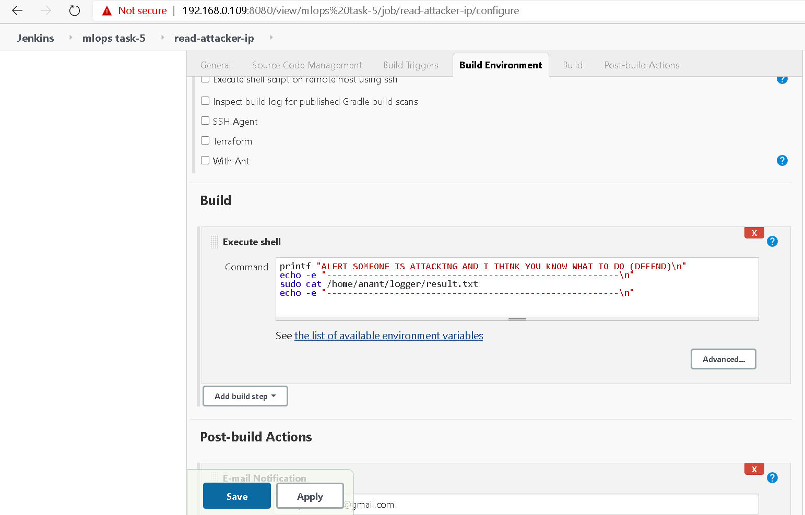

Detecting the Attacker from Logs using Machine Learning

This is something I have seen in many big websites specially with DDOS
protection. Here is the scenario, what if you try to launch a DDOS
attack on a website after some time you will see that the site is not
reachable from your connection anymore. This is because of DDOS
protection on that website. So, I thought why not try to make this
thing.

Technologies Used:\
Jenkins, Machine Learning, RHEL 8,NodeJs,Python, lots of google search.

\*Here I am breaking the task using a simple scenario\*

1\. This system will keep log of the information about the clients hit or
request to the server.

2\. This log data of clients will be used for finding the unusual pattern
of a client request for example if a client is sending request
repeatedly. for this purpose, we can use here clustering to make
clusters of different patterns of client request and to identify which
cluster of client requests can cause some security and performance issue
in the server.

3\. If any kind of unusual pattern we got then we can use Jenkins to
perform certain task for example it can run some command to block that
Ip which is causing this trouble.

Get ready to start the ride then

Note: Everything is done on RHEL 8 which is installed on Virtualbox

This is what my Jenkins looks like with all the tasks.

{width="6.5in" height="3.325in"}

I have divided the task into multiple Jenkins jobs for Ease

Job1 -- Copy logs

This job will copy the logs of httpd from /var/log/httpd/access\_log to
different destination on system because we cannot disturb the original
log file.

{width="5.466666666666667in"
height="2.933333333333333in"}

Job 2 -- send data from git

This job will pull the github repository and send it to the destination
folder here the folder is at /home/anant/logger

Special mention to AMAN JAGDEV for helping me out with nodejs code

Below is the github repo for the project.

<https://github.com/amanjagdev/apache-logger>

{width="5.433333333333334in"
height="3.2in"}

{width="5.283333333333333in"
height="2.8916666666666666in"}

Job-3 create csv

This job is using Nodejs and sorting the log file into csv file using
REGEX.

You will find the code snippet in the github repo.

{width="5.158333333333333in"
height="2.8833333333333333in"}

Job-4 CSV label

Actually I forgot to label the columns in CSV file so I made this
program Special thanks to RITIK AGARWAL for helping me out with this at
the last hour.

{width="5.444063867016623in"
height="3.0368055555555555in"}

Job-5 Find the attacker

This is where we are doing the machine learning magic

I would suggest to install python2 and pandas as well as sklearn to
perform this step and use pip2 for installation.

{width="5.277011154855643in"
height="2.925462598425197in"}

Job-6 Reading attacker ip

Here we will read the attacker Ip address and send the data to my Email.

{width="5.276388888888889in"
height="3.2037029746281713in"}

Note: Mail will be triggered in Post build Action.

Job-7 Saving-the-world

Here the system will block the malicious IP address

{width="5.2868055555555555in"
height="3.0277777777777777in"}

\-\-\-\-\-\-\-\-\-\-\-\-\-\-\-\-\-\-\-\-\-\-\--\> To Block An IP Address
\<\-\-\-\-\-\-\-\-\-\-\-\-\-\-\-\-\-\-\-\-\-\-\--

\#sudo iptables -A INPUT -s \<IP Address\> -j DROP

\-\-\-\-\-\-\-\-\-\-\-\-\-\-\-\-\-\-\-\-\-\-\--\> To Unblock An IP
Address \<\-\-\-\-\-\-\-\-\-\-\-\-\-\-\-\-\-\-\-\-\--

\#sudo iptables -D INPUT -s \<IP Address\> -j DROP

To test the environment you can use HULK DDos Tool for attacking

<https://allabouttesting.org/hulk-ddos-tool-complete-installation-usage-with-examples/#:~:text=HULK%20is%20a%20Denial%20of,network%20devices%20like%20a%20firewall.>

HULK is **a Denial of Service** (DoS**)** tool **used** to attack **web
servers** by generating **volumes of** unique and **obfuscated
traffic.** HULK\'s generated traffic also bypasses caching engines and
hits the server\'s direct resource pool. This tool is used to test
network devices like a firewall.

Note: Change your environment to python2

\#python hulk.py \<IP Address\>

Python hulk.py <http://192.168.0.110/>

Mine worked with Python hulk.py http://192.168.0.110/
